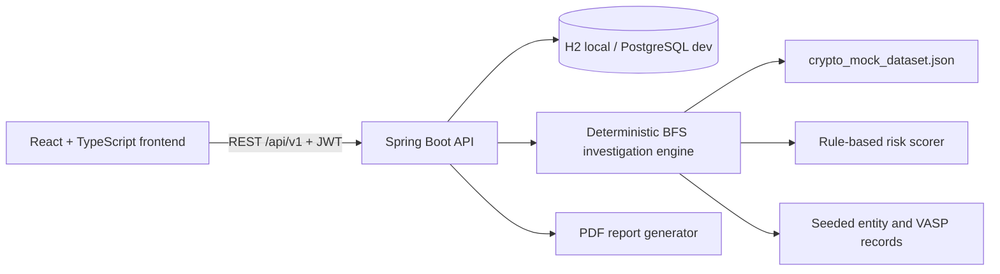

# LAPUS — Crypto Fraud Attribution Platform

> Smart India Hackathon 2026 · Problem Statement 26182
> Blockchain Intelligence / Crypto Fraud Attribution

LAPUS is an investigation platform for tracing suspicious cryptocurrency fund flows, identifying linked entities and Virtual Asset Service Providers (VASPs), visualizing transaction paths, reviewing deterministic findings and risk context, and generating evidence-backed PDF reports.

This repository contains the React frontend, Spring Boot backend, deterministic investigation engine, simulated blockchain dataset, local data-population utilities, tests, and supporting SIH documentation.

## Important MVP scope

This is a simulated-data MVP built for law-enforcement investigation workflows.

- Blockchain data comes from `crypto_mock_dataset.json`.
- No live blockchain node or production indexer is required for the main demo.
- Risk scoring is deterministic and rule-based.
- AI/GNN prediction is **not active** in this build.
- The local profile uses an H2 in-memory database.
- PostgreSQL and Redis configuration exists for the development/production-oriented architecture, but it is not required for the local demo.
- Generated reports are real PDF documents produced by the backend.

## Core demo flow

```text
Public homepage
  → Login
  → Dashboard analytics
  → Create case
  → Add suspect wallet
  → Start investigation
  → Monitor asynchronous progress
  → Explore the transaction graph
  → Review nearest identified VASP and findings
  → Generate and download a PDF report
```

Known dataset-backed example:

```text
node-114 → mocktx-19388 → node-10
                         Mock Dataset VASP
                         88.12 USDT
```

Other valid mock addresses include `node-145` and any existing `node-<number>` address from the dataset.

## Architecture



The running backend contract is the source of truth. The frontend normalizes backend DTO casing and naming inside its API adapters and Zod schemas.

## Technology stack

### Frontend

- React 19
- TypeScript 6
- Vite 8
- Tailwind CSS 4
- TanStack Query
- Zustand
- Zod
- React Router
- Cytoscape.js with cose-bilkent layout
- Chart.js with react-chartjs-2

### Backend

- Java 21
- Spring Boot 3.4
- Spring Web and Bean Validation
- Spring Security OAuth2 resource server with HS256 JWTs
- Spring Data JPA
- H2 for the local profile
- PostgreSQL and Flyway for the development profile
- Redis configuration for the broader development architecture
- iText PDF generation
- Maven / Maven Wrapper

## Repository structure

```text
SIH-2026/
├── frontend/                       React application
│   ├── src/api/                    REST adapters and response normalization
│   ├── src/app/                    Providers and router
│   ├── src/components/             Shared UI, graph, layout and analytics components
│   ├── src/hooks/                  TanStack Query and mutation hooks
│   ├── src/pages/                  Public and authenticated pages
│   ├── src/schemas/                Zod schemas and shared frontend types
│   ├── src/stores/                 Authentication and UI state
│   └── src/mocks/                  Deterministic auxiliary/mock data utilities
├── backend/backend/                Spring Boot backend
│   ├── src/main/java/              Controllers, services, entities and engines
│   ├── src/main/resources/         Profiles and Flyway migrations
│   ├── src/test/                   Backend tests
│   ├── populate_100.py             Optional 100-case API population script
│   └── seed_all_roles.py           Small per-role demo population script
├── crypto_mock_dataset.json        Dataset-backed blockchain graph
├── Related_Documents/              Architecture and specification documents
└── Problem_Statement/              SIH problem-statement material
```

## Prerequisites

Install the following before starting the project:

- Java 21
- Node.js with npm
- Python 3 only if running the optional data-population scripts
- Maven is optional because the repository includes `mvnw.cmd`

The project is compiled for Java 21. Java 25 may start the application with warnings, but Java 21 is the supported and verified version.

## Quick start — complete local demo

Run the backend and frontend in separate terminals.

### 1. Start the backend

From the repository root:

```powershell
cd backend\backend
```

#### PowerShell

```powershell
$env:JAVA_HOME="C:\Users\ASUS\.jdks\ms-21.0.10"
$env:Path="$env:JAVA_HOME\bin;$env:Path"
java -version
.\mvnw.cmd spring-boot:run "-Dspring-boot.run.profiles=local"
```

#### Command Prompt (`cmd.exe`)

```bat
set "JAVA_HOME=C:\Users\ASUS\.jdks\ms-21.0.10"
set "PATH=%JAVA_HOME%\bin;%PATH%"
java -version
mvnw.cmd spring-boot:run "-Dspring-boot.run.profiles=local"
```

Do not use PowerShell `$env:...` syntax inside Command Prompt. Likewise, do not use `%JAVA_HOME%` syntax inside PowerShell.

Successful startup includes:

```text
The following 1 profile is active: "local"
Tomcat started on port 8081
Loaded ... nodes and ... edges into memory
```

Backend URLs:

- API base: `http://localhost:8081/api/v1`
- Health: `http://localhost:8081/actuator/health`
- Swagger UI: `http://localhost:8081/swagger-ui/index.html`
- H2 console: `http://localhost:8081/h2-console`

Local H2 connection:

```text
JDBC URL: jdbc:h2:mem:vaspdb
User:     sa
Password: leave blank
```

### 2. Start the frontend

Open a second terminal at the repository root:

```powershell
cd frontend
npm install
npm run dev
```

Open `http://localhost:5173`.

The committed frontend environment points to:

```text
VITE_API_BASE_URL=http://localhost:8081/api/v1
```

Keep the frontend on port `5173` for the default local CORS configuration. If Vite selects `5174`, stop the old process occupying `5173` or restart the backend with an updated `FRONTEND_ORIGIN`.

### 3. Sign in

Canonical local demo account:

```text
Username: admin
Password: admin123
Role:     ADMIN
```

Additional local-profile users are created for role testing:

| Username | Password | Role |
|---|---|---|
| `demo` | `thisisit` | Investigator |
| `dev` | `thisisit` | DevOps |
| `mock` | `thisisit` | Investigator |

These credentials are development-only and must not be reused outside the local demo.

## Local database and automatic startup seeds

The `local` profile uses:

```text
jdbc:h2:mem:vaspdb;DB_CLOSE_DELAY=-1;DB_CLOSE_ON_EXIT=FALSE
```

On backend startup, `DevDataSeeder` creates:

- the four development users listed above;
- `Demo Exchange A`;
- `Demo Exchange B`;
- `Mock Dataset VASP`;
- mock VASP addresses `node-10` and `node-20`.

The automatic startup seed does **not** create 100 cases. Cases, wallets, investigations, findings, graphs and reports are created through the application/API or the optional scripts below.

Because H2 is in memory, stopping the backend deletes all locally created cases, investigations, findings and reports. The browser may still hold an old JWT after a restart. On application startup the frontend calls `/api/v1/auth/me`; if that identity no longer exists, it clears the stored session and returns to `/login`.

## Populate 100 realistic demo cases

The optional `populate_100.py` script creates 25 cases for each of the four seeded users, for a total of 100 cases. Each case receives:

- one valid dataset-backed mock wallet;
- one asynchronous investigation;
- a graph selected to contain roughly 10–80 nodes where dataset connectivity permits;
- findings generated by the real investigation engine;
- a generated PDF report after completion.

The first case for every role uses the canonical `node-114` attribution example.

With the backend already running on port `8081`:

```powershell
cd backend\backend
python -m pip install requests
python populate_100.py
```

The script is intentionally state-changing and may take several minutes because it waits for every asynchronous investigation to finish before generating its report.

Important:

- Run it only against the local/demo backend.
- Do not interrupt the backend while the script is running.
- Rerunning it creates another batch; it does not replace the previous batch.
- Restarting the local H2 backend clears the batch, so rerun the script after a fresh backend start when you want the populated dashboard again.

For a smaller role-oriented sample:

```powershell
python seed_all_roles.py
```

That script creates one case and investigation each for `demo`, `dev` and `mock`.

## Recommended demonstration

1. Visit `/` to show the public product landing page.
2. Sign in with `admin / admin123`.
3. Review dashboard totals and Chart.js analytics.
4. Create a new case with a unique case number.
5. Add a wallet with chain `mock` and address `node-114`.
6. Start an investigation with two or more hops.
7. Observe the status transition from pending/running to completed or failed.
8. Open the graph and switch between Attribution Path, 1 Hop, 2 Hops and Full Graph.
9. Use Go to Start, Go to VASP and Fit Visible.
10. Review nearest VASP attribution and rule-based findings.
11. Generate a report from a completed investigation.
12. Download the real PDF from the reports page.

## Wallet validation

Wallet validation is chain-aware.

### Mock chain

Valid pattern: `node-<number>`.

Examples: `node-114`, `node-145`.

### EVM-compatible chains

Supported frontend validation covers Ethereum, Polygon, BSC, Arbitrum and Optimism. A valid address is `0x` followed by exactly 40 hexadecimal characters.

Invalid chain/address combinations are rejected, including a `node-*` address paired with Ethereum or an EVM address paired with the mock chain.

## Investigation behavior

Investigations are asynchronous. The frontend submits a single POST, preserves the returned investigation ID, navigates to the progress view and polls the status endpoint.

Backend statuses:

```text
PENDING
INITIALIZING
RUNNING
COMPLETED
FAILED
CANCELLED
```

The frontend safely normalizes backend status casing for its internal UI representation.

The investigation engine performs deterministic breadth-first traversal. Attribution candidates remain ordered by:

1. hop count ascending;
2. evidence quality descending;
3. confidence descending;
4. received amount descending.

The canonical VASP finding type is `VASP_EXPOSURE`.

Risk remains rule-based. A missing risk score is shown as “Not available”; it is not converted into a fabricated `0/100` score.

## Graph behavior

The frontend uses canonical address-based Cytoscape node IDs. Before Cytoscape initialization it validates that:

- node IDs are non-empty;
- node IDs are unique;
- edge IDs are unique;
- every edge source exists;
- every edge target exists.

Invalid duplicate or orphan elements are removed before rendering and logged during development. Graph rendering is protected by an error boundary so a graph failure does not crash the authenticated application shell.

Entity type and risk are presented as separate visual dimensions. Supported entity visuals include START/suspect wallet, normal wallet, VASP/exchange, mixer, bridge, smart contract and unknown entity.

## Authentication and session recovery

The backend returns snake-case login fields such as `access_token` and `expires_in`. The frontend validates and normalizes this response internally.

Authentication is stored under one canonical browser key: `sih_auth_token`.

At application startup:

1. the frontend checks for a stored token;
2. it calls `/api/v1/auth/me`;
3. a valid identity restores the session;
4. an invalid or stale identity clears authentication state and returns the user to `/login`.

This is important for the local H2 profile because restarting the backend recreates user UUIDs while browser storage survives the restart.

## Frontend routes

| Route | Purpose | Access |
|---|---|---|
| `/` | Public landing page | Public |
| `/login` | Investigator login | Public |
| `/dashboard` | Counts, analytics and recent activity | Authenticated |
| `/cases` | Case list | Authenticated |
| `/cases/new` | Create a case | Authenticated |
| `/cases/:caseId` | Case details and wallets | Authenticated |
| `/wallets/:chain/:address` | Wallet details | Authenticated |
| `/explorer` | Cross-case investigation explorer | Authenticated |
| `/investigations/new` | Start investigation | Authenticated |
| `/investigations/:id/progress` | Investigation progress | Authenticated |
| `/investigations/:id/graph` | Interactive graph | Authenticated |
| `/investigations/:id/findings` | Findings and attribution | Authenticated |
| `/reports` | Generated reports | Authenticated |
| `/reports/new` | Generate report | Authenticated |
| `/reports/:reportId` | Report details | Authenticated |
| `/adminops` | Administration console | Admin |
| `/devops` | Operational console | DevOps |
| `/backend` | Backend console | DevOps |

## API overview

All main endpoints use the `/api/v1` prefix. Except for login, health and documentation endpoints, requests require a bearer token.

| Method | Endpoint | Purpose |
|---|---|---|
| `POST` | `/auth/login` | Authenticate and obtain a JWT |
| `GET` | `/auth/me` | Validate the current identity |
| `GET` / `POST` | `/cases` | List or create cases |
| `GET` / `PATCH` | `/cases/{caseId}` | Read or update a case |
| `GET` / `POST` | `/cases/{caseId}/wallets` | List or add case wallets |
| `POST` | `/investigations` | Start an asynchronous investigation |
| `GET` | `/cases/{caseId}/investigations` | List case investigations |
| `GET` | `/investigations/{id}` | Read investigation status |
| `GET` | `/investigations/{id}/graph` | Retrieve graph nodes and edges |
| `GET` | `/investigations/{id}/attribution` | Retrieve ordered attribution candidates |
| `GET` | `/investigations/{id}/findings` | Retrieve rule-based findings |
| `POST` | `/investigations/{id}/cancel` | Cancel an investigation |
| `GET` / `POST` | `/reports` | List or generate reports |
| `GET` | `/reports/{reportId}` | Retrieve report metadata |
| `GET` | `/reports/{reportId}/download` | Download the generated PDF |
| `GET` | `/wallets/{chain}/{address}` | Retrieve dataset-backed wallet details |
| `GET` | `/wallets/{chain}/{address}/transactions` | Retrieve wallet transactions |
| `GET` | `/transactions/{chain}/{txHash}` | Retrieve a transaction |
| `GET` | `/entities/address/{chain}/{address}` | Resolve a known entity address |
| `GET` / `POST` | `/risk/scores/{chain}/{address}`, `/risk/wallet` | Read or calculate rule-based risk |

The complete runtime API can be inspected through Swagger UI.

## Environment configuration

### Frontend

| Variable | Default/local value | Purpose |
|---|---|---|
| `VITE_API_BASE_URL` | `http://localhost:8081/api/v1` | Backend REST base URL |

### Backend

| Variable | Default | Purpose |
|---|---|---|
| `FRONTEND_ORIGIN` | `http://localhost:5173` | Allowed browser origin |
| `JWT_SECRET` | Local development secret | HS256 signing secret |
| `JWT_ISSUER_URI` | `http://localhost:8081` | JWT issuer |
| `SPRING_DATASOURCE_URL` | PostgreSQL URL in `dev` | Database connection |
| `SPRING_DATASOURCE_USERNAME` | `postgres` in `dev` | Database user |
| `SPRING_DATASOURCE_PASSWORD` | `postgres` in `dev` | Database password |
| `REDIS_HOST` | `localhost` | Redis host |
| `REDIS_PORT` | `6379` | Redis port |
| `ETHERSCAN_API_KEY` | empty | Optional Ethereum provider key |
| `ETHERSCAN_URL` | Etherscan API URL | Optional provider endpoint |
| `MAX_HOPS` | `5` | Configured investigation hop limit |
| `MAX_NODES` | `5000` | Configured investigation node limit |
| `INVESTIGATION_TIMEOUT` | `3600s` | Configured investigation timeout |

Never use the committed development JWT secret or credentials in a deployed environment.

## Frontend commands

Run from `frontend/`:

```powershell
npm install
npm run dev
npm run lint
npx tsc -p tsconfig.app.json --noEmit
npm run build
npm run preview
```

Additional scripts retained by the project:

- `npm run proj` starts Vite using the `proj` mode.
- `npm run mock` starts Vite using the `mock` mode.

These modes affect the frontend’s auxiliary generated/mock stores. The principal authentication, case, investigation, graph and report flows still use the Spring REST API, so the backend remains required for the integrated demo.

## Backend commands

Run from `backend/backend/` with Java 21 active:

```powershell
.\mvnw.cmd clean test
.\mvnw.cmd clean package
.\mvnw.cmd spring-boot:run "-Dspring-boot.run.profiles=local"
```

If using a globally installed Maven distribution, replace `.\mvnw.cmd` with `mvn`.

## PostgreSQL development profile

The default `application.yml` selects the `dev` profile. That profile expects PostgreSQL and enables Flyway migrations. For the self-contained demo, explicitly select `local` as shown in the quick-start instructions.

To use the development profile, provide an available PostgreSQL database and configure:

```powershell
$env:SPRING_DATASOURCE_URL="jdbc:postgresql://localhost:5432/vaspdb"
$env:SPRING_DATASOURCE_USERNAME="postgres"
$env:SPRING_DATASOURCE_PASSWORD="your-password"
.\mvnw.cmd spring-boot:run "-Dspring-boot.run.profiles=dev"
```

Flyway applies migrations from `backend/backend/src/main/resources/db/migration/`.

## Deployment guide

The recommended deployment shape for this repository is:

```text
Internet
   │
   ▼
HTTPS / Nginx
   ├── /              → Vite static frontend
   └── /api/*         → Spring Boot on 127.0.0.1:8081
                              │
                              ├── PostgreSQL
                              └── crypto_mock_dataset.json
```

Using one public origin keeps browser routing and CORS straightforward. The frontend is built with `VITE_API_BASE_URL=/api/v1`, while Nginx forwards that path to the backend.

The instructions below target an Ubuntu-style virtual machine. Package installation and service-management commands must be adapted for other operating systems.

### Deployment status and security warning

The repository currently has `local`, `test` and `dev` Spring profiles, but no hardened `prod` profile. The `dev` profile uses PostgreSQL and Flyway, but `DevDataSeeder` also creates known demonstration accounts.

Therefore, the steps below are appropriate for:

- an SIH demonstration server;
- an internal staging environment;
- a time-limited evaluator deployment;
- a server protected by network restrictions or an additional access layer.

Before unrestricted production use, create a dedicated production profile that does not run `DevDataSeeder`, remove or rotate every demo credential, store secrets in a managed secret service, configure persistent monitoring and backups, and complete a security review.

### 1. Prepare DNS and the server

Create a DNS record such as:

```text
lapus.example.com → <server-public-IP>
```

Install the required runtime packages:

```bash
sudo apt update
sudo apt install -y openjdk-21-jre-headless nginx postgresql postgresql-contrib
java -version
```

Install Node.js only if the frontend will be built on the server. A CI system can build the frontend and upload only `frontend/dist/` instead.

Create a non-login operating-system account and deployment directories:

```bash
sudo useradd --system --home /opt/lapus --shell /usr/sbin/nologin lapus
sudo install -d -o lapus -g lapus /opt/lapus/backend
sudo install -d -o lapus -g lapus /opt/lapus/data
sudo install -d -o root -g root /var/www/lapus
sudo install -d -o root -g lapus /etc/lapus
```

If the `lapus` account already exists, skip the `useradd` command.

### 2. Create the PostgreSQL database

Open the PostgreSQL shell:

```bash
sudo -u postgres psql
```

Create a dedicated database and user. Replace the example password:

```sql
CREATE USER lapus_app WITH PASSWORD 'replace-with-a-long-random-password';
CREATE DATABASE vaspdb OWNER lapus_app;
\q
```

The development profile has Flyway enabled, so database migrations run when the backend starts.

For a remote or managed PostgreSQL service, use the provider’s TLS connection requirements and firewall rules instead of exposing a local database port publicly.

### 3. Build release artifacts

Build and test the backend with Java 21:

```bash
cd backend/backend
./mvnw clean test
./mvnw clean package
```

The backend artifact is:

```text
backend/backend/target/vaspattribution-0.0.1-SNAPSHOT.jar
```

Build the frontend for same-origin API proxying:

```bash
cd ../../frontend
npm ci
VITE_API_BASE_URL=/api/v1 npm run build
```

The deployable frontend output is:

```text
frontend/dist/
```

`VITE_API_BASE_URL` is embedded at build time. Changing it after the build does not rewrite the generated JavaScript, so rebuild the frontend when the public API location changes.

`npm run preview` is only for checking the built frontend locally; it is not the production web server.

### 4. Upload the backend and dataset

Copy the JAR and mock dataset to the server. The exact `scp` source paths depend on where the repository is stored locally:

```bash
scp backend/backend/target/vaspattribution-0.0.1-SNAPSHOT.jar deploy@SERVER:/tmp/lapus.jar
scp crypto_mock_dataset.json deploy@SERVER:/tmp/crypto_mock_dataset.json
```

On the server:

```bash
sudo install -o lapus -g lapus -m 0750 /tmp/lapus.jar /opt/lapus/backend/lapus.jar
sudo install -o lapus -g lapus -m 0640 /tmp/crypto_mock_dataset.json /opt/lapus/data/crypto_mock_dataset.json
```

The dataset is required by the dataset-backed blockchain provider. Deployment should use an explicit dataset path instead of relying on the repository-relative development default.

### 5. Configure backend environment variables

Generate a strong JWT secret:

```bash
openssl rand -base64 48
```

Create `/etc/lapus/backend.env` with values appropriate for the server:

```dotenv
SPRING_PROFILES_ACTIVE=dev
SERVER_ADDRESS=127.0.0.1
SERVER_PORT=8081

SPRING_DATASOURCE_URL=jdbc:postgresql://127.0.0.1:5432/vaspdb
SPRING_DATASOURCE_USERNAME=lapus_app
SPRING_DATASOURCE_PASSWORD=replace-with-the-database-password

JWT_SECRET=replace-with-the-generated-secret
FRONTEND_ORIGIN=https://lapus.example.com

VASPATTRIBUTION_DATASET_PATH=/opt/lapus/data/crypto_mock_dataset.json

REDIS_HOST=127.0.0.1
REDIS_PORT=6379
```

Protect the environment file:

```bash
sudo chown root:lapus /etc/lapus/backend.env
sudo chmod 0640 /etc/lapus/backend.env
```

Notes:

- Use an exact browser origin for `FRONTEND_ORIGIN`; do not include a trailing slash.
- Keep the backend bound to `127.0.0.1` when Nginx runs on the same server.
- Do not commit the production environment file.
- Redis settings remain present in the architecture. If Redis-backed features are enabled, install Redis locally or point these variables to a managed instance.

### 6. Run the backend as a systemd service

Create `/etc/systemd/system/lapus.service`:

```ini
[Unit]
Description=LAPUS Crypto Fraud Attribution Backend
After=network-online.target postgresql.service
Wants=network-online.target

[Service]
Type=exec
User=lapus
Group=lapus
WorkingDirectory=/opt/lapus/backend
EnvironmentFile=/etc/lapus/backend.env
ExecStart=/usr/bin/java -jar /opt/lapus/backend/lapus.jar
SuccessExitStatus=143
Restart=on-failure
RestartSec=5
UMask=0027
NoNewPrivileges=true
PrivateTmp=true

[Install]
WantedBy=multi-user.target
```

Enable and start it:

```bash
sudo systemctl daemon-reload
sudo systemctl enable --now lapus.service
sudo systemctl status lapus.service
```

Inspect logs:

```bash
sudo journalctl -u lapus.service -f
```

Verify the private backend before configuring Nginx:

```bash
curl --fail http://127.0.0.1:8081/actuator/health
```

Expected result includes an `UP` status.

### 7. Upload the frontend

Create the temporary upload directory, then upload the contents of `frontend/dist/`:

```bash
ssh deploy@SERVER 'mkdir -p /tmp/lapus-frontend'
scp -r frontend/dist/* deploy@SERVER:/tmp/lapus-frontend/
```

On the server:

```bash
sudo rsync -a --delete /tmp/lapus-frontend/ /var/www/lapus/
sudo chown -R root:root /var/www/lapus
sudo find /var/www/lapus -type d -exec chmod 0755 {} \;
sudo find /var/www/lapus -type f -exec chmod 0644 {} \;
```

The `--delete` option makes the server directory match the new `dist` output. Confirm `/tmp/lapus-frontend/` is the intended release directory before running it.

### 8. Configure Nginx

Create `/etc/nginx/sites-available/lapus`:

```nginx
server {
    listen 80;
    listen [::]:80;
    server_name lapus.example.com;

    root /var/www/lapus;
    index index.html;

    location / {
        try_files $uri $uri/ /index.html;
    }

    location /api/ {
        proxy_pass http://127.0.0.1:8081;
        proxy_http_version 1.1;
        proxy_set_header Host $host;
        proxy_set_header X-Real-IP $remote_addr;
        proxy_set_header X-Forwarded-For $proxy_add_x_forwarded_for;
        proxy_set_header X-Forwarded-Proto $scheme;
        proxy_connect_timeout 10s;
        proxy_read_timeout 120s;
    }

    location = /actuator/health {
        proxy_pass http://127.0.0.1:8081/actuator/health;
        access_log off;
    }

    location ~* \.(?:css|js|png|jpg|jpeg|svg|webp|woff2?)$ {
        expires 7d;
        add_header Cache-Control "public, max-age=604800, immutable";
        try_files $uri =404;
    }
}
```

The SPA fallback is important: routes such as `/dashboard`, `/cases/...` and `/reports/...` must return `index.html` when opened or refreshed directly.

Enable the site and validate the configuration:

```bash
sudo ln -sfn /etc/nginx/sites-available/lapus /etc/nginx/sites-enabled/lapus
sudo nginx -t
sudo systemctl reload nginx
```

Remove or disable the default Nginx site if it conflicts with the selected domain.

### 9. Enable HTTPS

Use the organization’s load balancer, cloud certificate manager or an ACME client to obtain a trusted TLS certificate. Redirect HTTP to HTTPS and keep `FRONTEND_ORIGIN` set to the final `https://` origin.

After enabling TLS:

```bash
curl --fail https://lapus.example.com/
curl --fail https://lapus.example.com/actuator/health
```

Do not expose port `8081`, PostgreSQL or Redis to the public internet. Only ports `80` and `443` should normally be reachable externally.

### 10. Seed staging data if required

The PostgreSQL-backed `dev` profile automatically creates the local demo identities and known entity records because `DevDataSeeder` includes the `dev` profile.

For a populated, access-controlled SIH staging environment, run the API population script from a trusted machine only after confirming it points to the intended deployment. The script currently defaults to `http://localhost:8081/api/v1`, so either run it on the application server against the loopback backend or update its base URL deliberately.

Do not run `populate_100.py` against a real production database.

### 11. Deployment verification checklist

Verify the following after every release:

- `GET /actuator/health` returns `UP`.
- `/` loads the public homepage over HTTPS.
- refreshing `/login` and `/dashboard` does not produce an Nginx 404.
- `admin / admin123` works only in the intentionally seeded demo environment.
- a hard refresh preserves a valid authenticated session.
- stale authentication is cleared after a database reset.
- a case can be created and appears in the dashboard count.
- `node-114` can be added as a mock wallet.
- an investigation reaches a terminal status without duplicate POSTs.
- the graph renders with zero orphan edges.
- nearest VASP attribution appears for the canonical dataset path.
- a real PDF report can be generated and downloaded.
- browser developer tools show no CORS or mixed-content failures.
- backend logs contain no repeated authentication, database or dataset errors.

### 12. Updating an existing deployment

For each release:

1. run frontend lint, TypeScript and build checks;
2. run backend tests and package the JAR;
3. back up PostgreSQL;
4. retain the previous JAR and frontend `dist` directory;
5. upload the new artifacts;
6. restart `lapus.service`;
7. reload Nginx only if its configuration changed;
8. run the deployment verification checklist.

Backend update example:

```bash
sudo cp /opt/lapus/backend/lapus.jar /opt/lapus/backend/lapus.previous.jar
sudo install -o lapus -g lapus -m 0750 /tmp/lapus.jar /opt/lapus/backend/lapus.jar
sudo systemctl restart lapus.service
sudo systemctl status lapus.service
```

### 13. Rollback

If the new backend fails health checks:

```bash
sudo systemctl stop lapus.service
sudo mv /opt/lapus/backend/lapus.previous.jar /opt/lapus/backend/lapus.jar
sudo systemctl start lapus.service
curl --fail http://127.0.0.1:8081/actuator/health
```

Restore the previous frontend directory or artifact if the UI release is defective. If Flyway applied a database migration, do not blindly restore only the old JAR: confirm schema compatibility or restore the coordinated database backup.

### 14. Production hardening checklist

Before handling any non-simulated or sensitive data:

- add a dedicated `prod` Spring profile;
- ensure `DevDataSeeder` cannot run in production;
- remove all known demo users and passwords;
- use a managed secret store and rotate JWT/database secrets;
- use a persistent, encrypted PostgreSQL service with tested backups;
- restrict database and Redis access to private networks;
- add rate limiting at the gateway;
- configure structured logs, metrics, alerting and audit retention;
- define retention and deletion policies for cases and reports;
- review PDF storage and access controls;
- configure dependency and container/image scanning if containers are introduced;
- perform authentication, authorization and penetration testing;
- verify legal and organizational requirements before connecting real blockchain or personal data.

### Managed deployment: Vercel + Render

The repository includes the configuration needed for the managed demo deployment:

- `frontend/vercel.json` builds the Vite application and provides the React Router SPA fallback;
- `Dockerfile.backend` builds and runs the backend with Java 21;
- `.dockerignore` keeps the backend image context small and excludes local secrets/build output;
- `render.yaml` creates the Render web service and PostgreSQL database, generates the JWT secret, wires database credentials, selects the Singapore region and configures the health check.

Use this order to resolve the frontend/backend URL dependency:

1. Import the repository into Vercel with `frontend` as the Root Directory. Temporarily set `VITE_API_BASE_URL` to `https://placeholder.invalid/api/v1`, deploy, and copy the assigned Vercel URL.
2. In Render, create a **New Blueprint** from the same repository. Render reads `render.yaml`. When prompted for `FRONTEND_ORIGIN`, enter the exact Vercel origin, such as `https://your-project.vercel.app`, without a trailing slash.
3. Wait for `lapus-postgres` and `lapus-api` to become available. Confirm `https://YOUR-RENDER-HOST/actuator/health` returns `{"status":"UP"}`.
4. In Vercel, replace the temporary variable with `VITE_API_BASE_URL=https://YOUR-RENDER-HOST/api/v1` and redeploy the frontend.

The Blueprint uses the `dev` Spring profile because that is the repository's current PostgreSQL-backed demo profile. It seeds the known demo users, including `admin / admin123`. Do not treat that credential or profile as a hardened public-production setup.

## Troubleshooting

### Java reports version 25 instead of 21

Set `JAVA_HOME` and prepend its `bin` directory to `PATH` in the same terminal before running Maven. Confirm `java -version` prints Java 21.

### Port 8081 is already in use

PowerShell:

```powershell
Get-NetTCPConnection -LocalPort 8081 -State Listen | Select-Object LocalAddress, LocalPort, OwningProcess
Get-Process -Id <PID>
Stop-Process -Id <PID>
```

Command Prompt:

```bat
netstat -ano | findstr LISTENING | findstr :8081
tasklist /FI "PID eq <PID>"
taskkill /PID <PID> /F
```

Verify the PID belongs to an old backend process before stopping it. Do not start multiple backends on different ports unless the frontend API URL and CORS origin are also updated deliberately.

### Dashboard shows zero cases

A fresh local H2 database contains users and entity seeds but no generated cases. Create a case manually or run `populate_100.py` while the backend is running.

### Login appears valid but actions return “User not found”

This usually means the H2 backend restarted while the browser retained an older JWT. Reload the frontend. Startup session hydration should call `/auth/me`, clear the stale token and redirect to `/login`. Then sign in again.

### Frontend starts on port 5174

Another process is already using `5173`. Stop the old frontend process so the default backend CORS rule continues to match, or update `FRONTEND_ORIGIN` and restart the backend.

### Dataset cannot be loaded

Keep `crypto_mock_dataset.json` at the repository root. The local backend resolves it relative to `backend/backend/` and also checks the current working directory as a fallback.

### Python population script cannot import `requests`

```powershell
python -m pip install requests
```

### Graph preview is empty

Confirm the investigation reached `COMPLETED`, the selected wallet exists in `crypto_mock_dataset.json`, and the configured hop depth reaches connected transactions. The population script deliberately selects connected starts with at least ten reachable nodes.

## Documentation

Additional project documents are located in `Related_Documents/`:

- `Technical_Approach.md`
- `Technical_Approach_PPT.md`
- `Frontend_Specification.md`
- `Backend_API_Specification.md`
- `TGN_Architecture.md`
- `PPT_Content.md`

Backend compliance notes are available in `backend/prd_compliance_matrix.md`.

## Security and data disclaimer

- All included credentials are for local demonstration only.
- The mock dataset does not represent live personal or blockchain information.
- Do not present deterministic demo findings as production intelligence.
- Configure independent secrets, persistent storage, access controls, audit retention and deployment hardening before any non-demo use.

---

Built for Smart India Hackathon 2026 · PS 26182.
