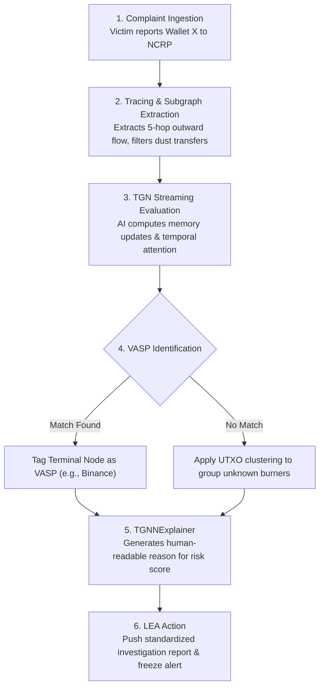
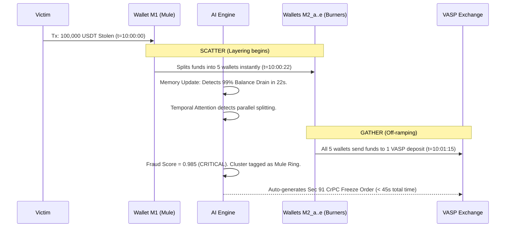
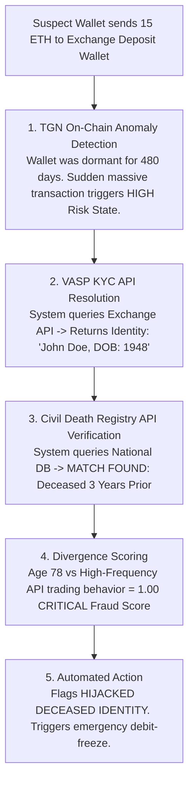

# Real-Time Crypto Fraud Attribution System
### Smart India Hackathon - Comprehensive Architecture & Execution Guide

---

## 1. Executive Summary & The Problem Statement
Cyber fraud victims frequently report suspect cryptocurrency wallets associated with investment scams, ransomware, and phishing. Criminals use **burner wallets, intermediary layering, and mixers** to obfuscate the trail, eventually cashing out at an exchange (VASP). 

**The Challenge:** Manual blockchain tracing takes days and significant technical expertise. By the time investigators identify the terminal VASP, the funds are gone. 
**The SIH Objective:** A system that ingests complaints, automatically performs blockchain tracing, detects fund movement patterns across chains, identifies the nearest VASP, and integrates with platforms like SAHYOG and NCRP for immediate asset freezing.

**Our Solution:** A **Continuous Temporal Graph Network (TGN)** platform. Instead of manual tracing or static database queries, our AI treats the blockchain as a live, microsecond-accurate stream. It mathematically models the flow of illicit funds, instantly detecting automated laundering patterns and auto-generating court-ready evidence to freeze assets before they are withdrawn.

---

## 2. Understanding the AI: Graphs, GNNs, and TGNs (In Simple Terms)

To understand how our system automates tracing, we must understand the AI powering it.

### 2.1 What is a Graph in Blockchain?
A **Graph** is simply a network:
*   **Nodes:** The entities (Wallets, Exchanges, Smart Contracts).
*   **Edges:** The transactions moving money between them.

### 2.2 Static AI vs. Temporal Graph Network (TGN)
Imagine watching a football match to find a coordinated cheating strategy:
*   **Static Graph Neural Network (GNN):** Takes a single photograph of the field every 10 minutes. You see where players are, but you miss how fast they ran or the rapid sequence of passes. If money moves through 5 wallets in 30 seconds, a static GNN misses the speed of the crime.
*   **Temporal Graph Network (TGN):** Captures a continuous video stream. It records the exact microsecond every transaction occurs, tracking how fast money is forwarded (velocity). It maintains a "memory" of every wallet's behavior.

**Why TGN?** Scammers use automated scripts. Funds deposited at 10:00:00 AM are split into 10 wallets and sent to an exchange by 10:01:00 AM. TGNs detect this high-velocity layering instantly, which is impossible for human investigators or traditional databases.

---

## 3. End-to-End System Architecture

This flowchart demonstrates the complete lifecycle: from a victim filing an NCRP complaint to the TGN processing the graph, and finally sending alerts to Law Enforcement Dashboards.

```mermaid
graph TD
    subgraph 1. Data Ingestion & Integration
        A[Victim Complaint via NCRP] --> B(Blockchain Node / Indexer)
        C[Live Mempool / Cross-Chain Streams] --> B
    end

    subgraph 2. Graph Construction
        B --> D{Dynamic Graph Data}
        D -->|Nodes| E[Wallets, VASPs, Mixers]
        D -->|Edges| F[Transactions: Amount, Timestamp]
    end

    subgraph 3. TGN Analytics Core (AI Engine)
        E --> H[Feature Encoder]
        F --> H
        H --> I[Message & Memory Updater GRU<br/>Updates the historical 'memory' of wallets]
        I --> J[Temporal Attention Engine<br/>Analyzes structural neighbor behavior]
        J --> K[Prediction Layer MLP]
        K -->|Risk Score| L[Classification: Mule, Burner, Safe]
    end

    subgraph 4. Output & LEA Action
        L --> M[TGNNExplainer: Subgraph Evidence Generation]
        M --> N[VASP KYC & Civil Registry APIs]
        N --> O[Automated Freeze Requisition via SAHYOG]
        O --> P[LEA Investigator Dashboard]
    end
```

---

## 4. Deep-Dive: TGN Core Modules & Feature Engineering

To achieve SIH's requirement for "AI/ML-assisted risk detection," raw blockchain data is converted into normalized vectors and processed through 6 core modules.

### 4.1 Node & Edge Features Extracted
*   **Node Features (\(x_v\)):** `Account_Age` (flags newly created burners), `Max_Balance_Spike_Ratio` (detects sudden influx of stolen capital), `Known_Entity_Tag` (identifies known VASPs).
*   **Edge Features (\(e_{uv}\)):** `Time_Delta_Sender` (\(\Delta t_u\)) (crucial for velocity), `Transacted_Value_USD`, `Balance_Drain_Ratio` (pass-through mules drain >95% instantly).

### 4.2 TGN Processing Logic
1.  **Memory Module:** Stores a persistent state vector \(s_i(t)\) acting as a long-term memory bank for every wallet.
2.  **Message & Aggregator Module:** Computes a summary "memo" of the interaction whenever funds move: \(m_u(t) = \text{MLP}_s(s_u(t^-), s_v(t^-), \Delta t_u, e_{uv})\).
3.  **Memory Updater (GRU):** Updates the wallet's memory bank with new behaviors: \(s_i(t) = \text{GRU}(\bar{m}_i(t), s_i(t^-))\).
4.  **Temporal Attention:** Checks what a wallet's neighbors are doing to prevent memory staleness.
5.  **Classification Decoder:** Outputs the final Fraud Risk Score (0.0 to 1.0).

---

## 5. Specific Investigation Case Flowcharts

The SIH statement requires identifying automated pattern recognition for fraud typologies. Here is how the system handles specific cases.

### Case 1: General Flow (Victim Report to VASP Identification)
How a standard complaint is processed to find the nearest VASP receiving direct deposits.



### Case 2: Detecting Mule Accounts & Layering (Scatter-Gather)
Mules receive illicit funds and rapidly split them (peel chains) before depositing them into an exchange. The TGN detects this purely through structural velocity.



### Case 3: Handling Deceased Persons / Ghost Accounts
Fraudsters use stolen identities of deceased individuals to pass VASP KYC checks. Our system combines on-chain AI anomaly detection with off-chain API integration.



---

## 6. Fulfilling the SIH Problem Statement Objectives

This TGN architecture directly addresses every requirement outlined in the SIH problem description:
1.  **Automated VASP Identification:** By mapping the transaction graph dynamically, it traces layered funds directly to the terminal exchange deposit address.
2.  **Real-Time Tracing:** Processes transactions in milliseconds (stream processing), completely eliminating the 24-48 hour delay of manual tracing.
3.  **Pattern Recognition:** Identifies mixers, peel chains, and mule networks through temporal embedding vectors, catching new fraud typologies before human investigators notice them.
4.  **LEA Integration:** Generates court-ready, explainable evidence packages (via TGNNExplainer) and connects seamlessly with SAHYOG and NCRP for automated freeze orders.
